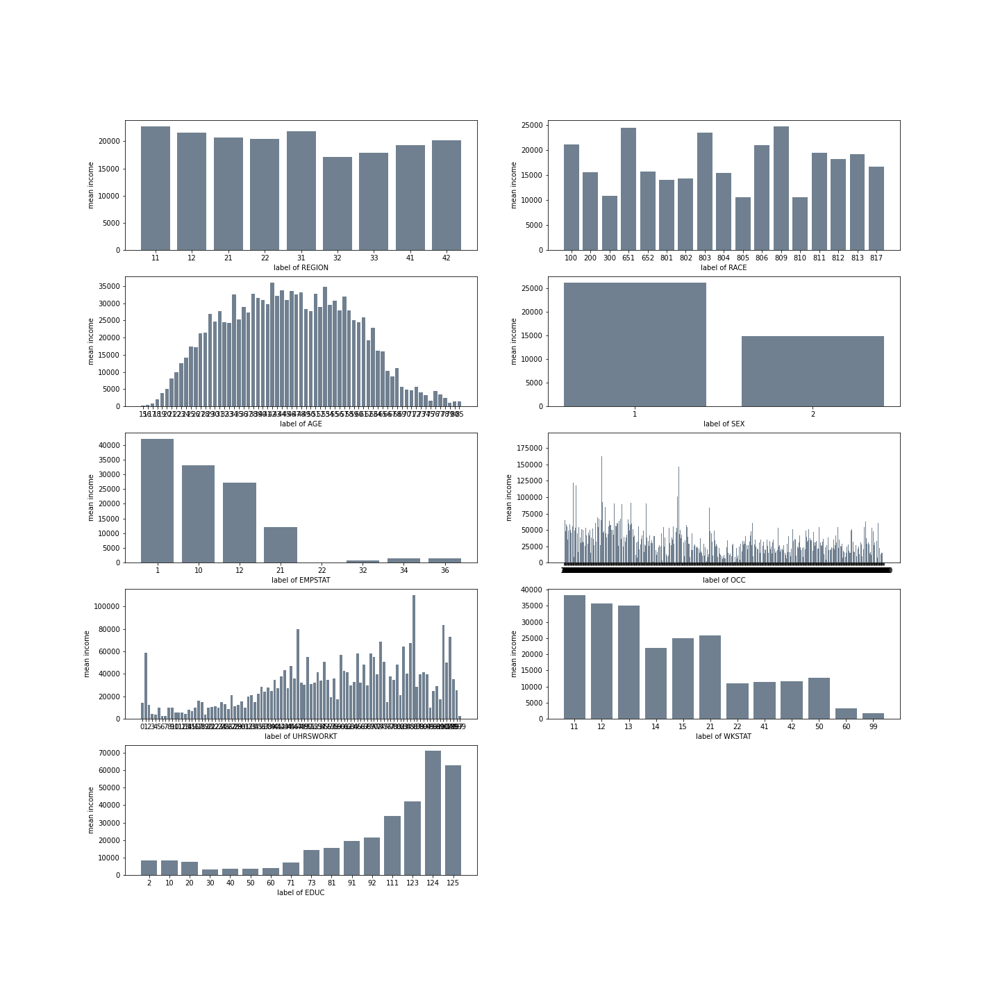

# Econ Salary Prediction by beginners-newbies

**Authors**:

**Ruoyu Hou**, Halıcıo ̆glu Data Science Institute, University of California San Diego, San Diego, rhou@ucsd.edu

**Weiyue Li**, Halıcıo ̆glu Data Science Institute, University of California San Diego, San Diego, wel019@ucsd.edu

**Yi Li**, Halıcıo ̆glu Data Science Institute, University of California San Diego, San Diego, yil115@ucsd.edu

**Wenhua Liang**, Halıcıo ̆glu Data Science Institute, University of California San Diego, w7liang@ucsd.edu

---

## 1. Introduction

People are interested in predicting salary in the fields of Economics. However, there are numerous features that play roles of determining individual's income. According to U.S. Bureau of Labor Statistics, features such as higher educational attainment usually correlate with higher income. Since the number of social-economics factors are large, it would be great that we could come-up with a prediction model that predicts individual's salary based on their unique features. In this project, we were utilizing IPUMS CPS(https://cps.ipums.org/cps/index.shtml) data to achieve our goal.

Something to notice is the language we will use below. Before running statistical testing on the ceteris paribus causal inference, we shall never use the word "causes" in our conclusion. In fact, it is hard to draw causal inference because we need apple-to-apple comparison to the potential outcomes of treated and untreated of same individual. For example, we need data of same individual's salary if he has a master degree vs if he only have a high school diploma. However, one of the potential outcome is never observed, which made such comparison impossible. Thus, to draw this ceteris paribus causal inference, we need to compute the Average treatment Effect.

## 2. Data Cleaning & Preprocessing, Feature Engineering

First, we noticed that the data set has 29 columns:

```
['YEAR', 'SERIAL', 'MONTH', 'HWTFINL', 'CPSID', 'ASECFLAG', 'HFLAG', 'ASECWTH', 'REGION', 'STATEFIP', 'NFAMS', 'PERNUM', 'WTFINL', 'CPSIDP', 'ASECWT', 'AGE', 'SEX', 'RACE', 'MARST', 'BPL', 'EMPSTAT', 'OCC', 'UHRSWORKT', 'WKSTAT', 'JOBCERT', 'EDUC', 'EDDIPGED', 'INCWAGE', 'OINCWAGE']
```

where the `INCWAGE` column describes the salaries we are interested in. 

### 1. Clean Data

But after looking at values in the `INCWAGE` column, we found many `nan`s and abnormal values like `99999999` (according to the IPUMS source, `99999999` stands for "not in universe"). 

```
total surveys: 54737
number of N.I.U wage: 5543
number of NaN wage: 30160
number of 0 wage: 7496
number of wage > 0: 11538
number of wage >= 0: 19034
```

We exclude these data from our dataframe since they cannot help us make predictions: (`data` is the raw data set, `NIU` equals to 99999999)

```python
raw_data = pd.read_csv('../data/beginner.csv')
clean_data = raw_data[(raw_data["INCWAGE"] != 99999999.0) & (raw_data["INCWAGE"] != 0.0)]
clean_data = clean_data.dropna(subset = ['INCWAGE'])
clean_data = clean_data.dropna(how = 'all', axis = 1)
clean_data = clean_data.drop(columns = ['HFLAG', 'ASECFLAG', 'MONTH', 'CPSID', 'SERIAL', 'CPSIDP'])
clean_data.info()
```

> ```
> <class 'pandas.core.frame.DataFrame'>
> Int64Index: 11538 entries, 0 to 54733
> Data columns (total 19 columns):
>  #   Column     Non-Null Count  Dtype  
> ---  ------     --------------  -----  
>  0   YEAR       11538 non-null  int64  
>  1   ASECWTH    11538 non-null  float64
>  2   REGION     11538 non-null  int64  
>  3   STATEFIP   11538 non-null  int64  
>  4   NFAMS      11538 non-null  int64  
>  5   PERNUM     11538 non-null  int64  
>  6   ASECWT     11538 non-null  float64
>  7   AGE        11538 non-null  int64  
>  8   SEX        11538 non-null  int64  
>  9   RACE       11538 non-null  int64  
>  10  MARST      11538 non-null  int64  
>  11  BPL        11538 non-null  int64  
>  12  EMPSTAT    11538 non-null  int64  
>  13  OCC        11538 non-null  int64  
>  14  UHRSWORKT  11538 non-null  int64  
>  15  WKSTAT     11538 non-null  int64  
>  16  EDUC       11538 non-null  int64  
>  17  INCWAGE    11538 non-null  float64
>  18  OINCWAGE   11538 non-null  float64
> dtypes: float64(4), int64(15)
> memory usage: 1.8 MB
> ```

### 2. Adjust income for inflation

> https://cps.ipums.org/cps/cpi99.shtml

We need to inflate or deflate the dollar amounts of `INCWAGE` in order to make them comparable, so we convert the dollar amounts to constant 1999 dollars by multiplying the CPI99 constants of that data year to the `INCWAGE` values:

We first record these constants in a static `.json` file so that it can be easily loaded as a dictionary:

```python
with open(data_pth / 'cpi99_cons.json', 'w') as fout:
    json.dump(cpi99_cons, fout)
```

Then, generate a series of the corresponding CPI99 constants of that data year and multiply the constants to the raw dollar amounts of `INCWAGE`:

```python
def clean_incwage(df):
    cpi99 = df['YEAR'].apply(lambda yr : cpi99_cons[str(yr)])
    df['inc_cpi99'] = df['INCWAGE'] * df['cpi99']

    df.groupby('YEAR').mean()['INCWAGE'].plot(legend=True)
    df.groupby('YEAR').mean()['inc_cpi99'].plot(legend=True)
    
clean_wage(filtered)
```


As shown, the adjusted values are deflated as they are after 1999.

### 3. Choose & Adjust appropriate factors

Then, after exploring these columns and the descriptions (e.g. https://cps.ipums.org/cps-action/variables/BPL#description_section), we decided to focus on columns as below:

```
['REGION', 'RACE', 'AGE', 'SEX', 'EMPSTAT', 'OCC', 'UHRSWORKT', 'WKSTAT', 'EDUC']
```

Visualize the relations between each factor and `INCWAGE` (note that some factors have the labels as codes) 

```python
def display_categ(df):
    indices = ['REGION', 'RACE', 'AGE', 'SEX', 'EMPSTAT', 'OCC', 'UHRSWORKT', 'WKSTAT', 'EDUC']
    
    fig, axs = plt.subplots(5, 2, figsize=(20, 20), constrained_layout=False)

    for i in range(len(indices)):
        ax = axs.flat[i]
        it = indices[i]
        ser = df.groupby(it).mean()['inc_cpi99']
        ax.bar(list(map(str, ser.index)), ser.values.tolist(), color='slategrey')
        
        ax.set_ylabel("mean income")
        ax.set_xlabel(f"label of {it}")
    
    return fig, axs

fig, axs = display_categ(filtered)
```



#### 1. Region, Race, Occupation

According to the IPUMS, region codes are:


Connected to our graph, Mean income in New England Division (11) and South Atlantic Division (31) are higher, while East South Central Division (32) has the lowest mean. 

We sort the region labels by the mean income value and give them ordinal numbers:

```python
ser = filtered.groupby('REGION').mean()['inc_cpi99'].sort_values()
region_ord = ser.reset_index()['REGION']
region_ord = {region_ord.loc[i] : i  for i in region_ord.index}
filtered['region_ord'] = filtered['REGION'].apply(lambda x : region_ord[x])
```

We apply the same approach to `RACE` and `OCC` columns.

#### 2. Age

The relationship between age and salary can be described by a bell-shaped pattern that emphasizes a peaked salary around the age of 40 to 50. It can be observed that at an age before 40, salaries are clearly less than that who have reached their 40 to 50. Moreover, there experiences a gradual upward trend as age increases in the quantification of salary. Similarly, it can be observed that at an age after 50, salaries also becomes less than those who are at their 40 to 50. In addition, a gradual, downward trend can be observed from the display of the relationship between age and salary. 

We choose a centered age of 45 (where the area left to 45 is equal to the area right to 45):

```python
def age_score(df):
    salary_vs_age = df[['AGE', 'inc_cpi99']]
    plt.rcParams["figure.figsize"] = (16,4)

    mean_inc_by_age = df.groupby('AGE').mean()['inc_cpi99']
    mean_inc_by_age.plot(kind='bar', color='slategrey', alpha=.5)
    
    age_lst = mean_inc_by_age.index.tolist()

    l = np.min(age_lst)
    r = np.max(age_lst)
    while l <= r:
        mid = (l + r) >> 1
        lower = mean_inc_by_age.iloc[:mid].sum()
        upper = mean_inc_by_age.iloc[mid:].sum()
        if lower >= upper:
            r = mid - 1
        else:
            l = mid + 1
    
    plt.axvline(r, color='brown')
    plt.savefig('age_centered.png')
    
age_score(filtered)
```


```python
filtered['age_c'] = abs(filtered['AGE'] - 45)
filtered.groupby('age_c').mean()['inc_cpi99'].plot(color='brown')
plt.savefig('age_centered_plot.png')
```


#### 3. Other indices 

Other indices, including `EDUC` (education) and `WKSTAT` have been properly ordered by their codes. We leave them unchanged.

---

## 3. Models

### 3.1 Linear Regression With Ordinal Columns

We use the adjusted columns to run a linear regression:

```python
def least_squares_regression(X, y):
    """ Find the least squares regression plane using the normal equations """
    return np.linalg.solve(X.T @ X, X.T @ y)
    
def mse_with_vars(df, ob, vars, f=None) :    
    data = df.get(vars).values.tolist()
    
    design_mat = np.array([[1, *row] for row in data])
    observ_vec = np.array(df[ob].values)
    
    w = least_squares_regression(design_mat, observ_vec)

    err_vec = observ_vec - design_mat @ w
    mse = np.dot(err_vec, err_vec) / len(data)

    return w, mse

mse_with_vars(
    filtered, 'inc_cpi99',
    ['region_ord', 'race_ord', 'age_c', 'SEX', 'EMPSTAT', 'occ_ord', 'UHRSWORKT', 'WKSTAT', 'EDUC']
)
```

> ```
> <class 'numpy.ndarray'>
> (array([ 8.72228854e+02,  2.04811704e+02,  2.45518832e+02, -2.56547011e+02,
>         -5.45191102e+03,  3.09293242e+02,  8.93171050e+01,  2.76527878e-01,
>         -1.32927802e+02,  1.43378040e+02]),
>  879818925.1034607)
> ```

where the $mse$ is approximately $8.8\times 10^8$.

---

## 4. Conclusion


